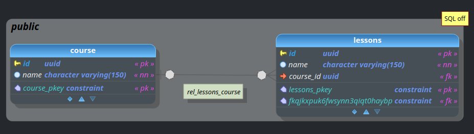
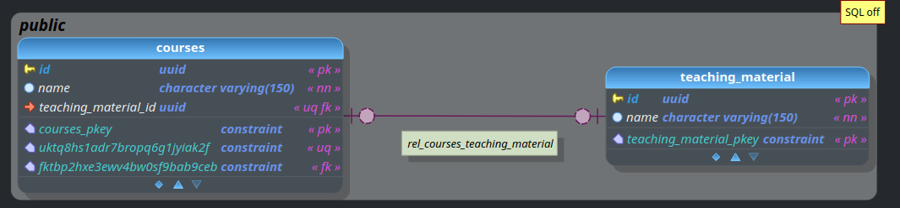
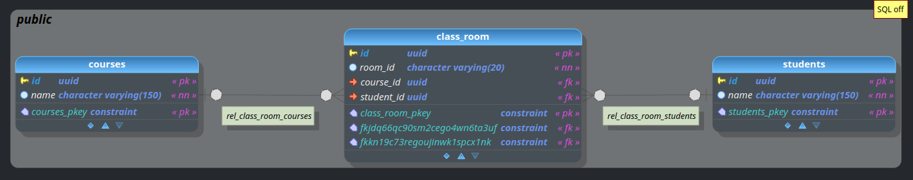

## Examples of jpa.
  
### Layers
  ##### CommandLine -> Service -> JpaRepository/Entity  

### Contain Examples
  - One to many [One to Many](one-to-many)
  
  - One to One
  
  - Many to One
  - Many to Many
  
